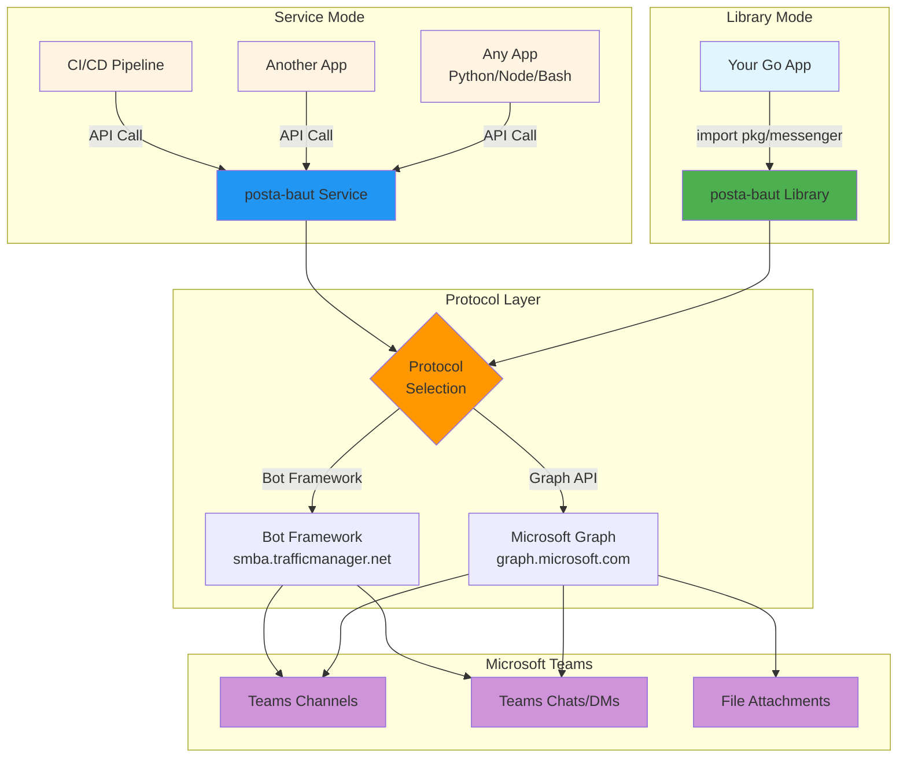

# posta-baut

**Send Microsoft Teams messages from your apps - use it as a library or run it as a service.**

---

## What's this?

`posta-baut` helps you send messages to Microsoft Teams. You can use it two ways:

**1. As a library** - Import it into your Go code and call `messenger.SendChatMessage()` or `messenger.SendChannelMessage()`. You manage credentials, we handle the Microsoft API complexity.

**2. As a service** - Run a message relay that your apps can call. Apps make simple API requests, the service handles authentication, protocol selection, retries, and delivery.

Pick whichever fits your needs. Same features, different delivery.

---

## How it works

---

## Why does this exist?

Sending Teams messages shouldn't be complicated. But Microsoft has multiple APIs, authentication is a pain, and features are scattered everywhere.

`posta-baut` fixes that:

### Problem: "I just want to send a message from my code"

Without `posta-baut`, you need to learn Microsoft Graph API or Bot Framework API, figure out OAuth 2.0 token flows, handle token refresh, write retry logic, and build error handling.

With `posta-baut`, you just call the send method. Done.

### Problem: "I can't send DMs, only channel messages"

A lot of Teams tools only support channels. What if you need to DM someone when their PR is ready or alert the on-call engineer? `posta-baut` handles DMs as easily as channels.

### Problem: "Should I use Graph API or Bot Framework?"

Microsoft has multiple APIs for Teams messaging. They do different things. The docs don't make it clear when to use which.

`posta-baut` lets you pick - or handles it for you:
- **Graph API**: Better for DMs, file attachments, reactions
- **Bot Framework**: Better for conversational bots

### Problem: "Multiple teams need to send messages with different credentials"

When you run `posta-baut` as a service, you can support multiple teams with their own configs. Each team brings their own credentials and protocol preferences - you run one service, everyone's happy.

---

## Who should use this?

### Use it as a library if:

- You're writing Go code
- You have your Microsoft credentials (tenant ID, client ID, secret)
- You want to send Teams messages directly from your application

**Example use cases:**
- Your Go service sends notifications when events happen
- Your CLI tool notifies teams about deployments
- Your monitoring system alerts via Teams

### Use it as a service if:

- You have multiple apps/teams that need to send Teams messages
- You want a central place to manage credentials and configuration
- Your apps aren't written in Go (Python, Node, Java, whatever)
- You want apps to just make API calls without Teams-specific code
- You need multi-tenant support

**Example use cases:**
- Central notification hub for your platform
- Teams relay service for your organization
- Shared service that multiple teams can use
- Abstraction layer so apps don't need Microsoft SDKs

---

## Library vs Service - Which one?

| Aspect | Library | Service |
|--------|---------|---------|
| **Integration** | Import package in Go | API from any language |
| **Credentials** | You manage in your app | Service manages centrally |
| **Multi-tenant** | Build it yourself | Built-in |
| **Deployment** | Part of your app | Separate service to run |
| **Best for** | Single app, Go-based | Multiple apps, any language |

**Can't decide?** If you find yourself duplicating code across apps, switch to running it as a service.

---

## Getting started

**Library mode:** `go get github.com/bautistv/posta-baut` and import `pkg/messenger`

**Service mode:** Clone the repo, add your team configs, run the service

TODO: Add docs folder

See the [docs](./docs/) for setup details, required Microsoft permissions, and examples.

---
