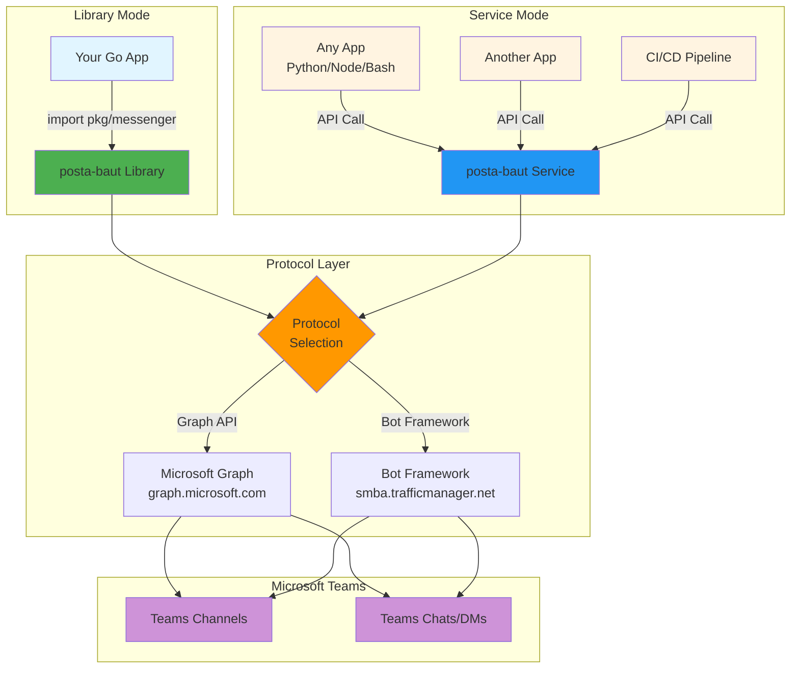

# posta-baut

**Send Microsoft Teams messages from your apps - use it as a library or run it as a service.**

---

## What's this?

`posta-baut` helps you send messages to Microsoft Teams. You can use it two ways:

**1. As a library** - Import it into your Go project and call `messenger.SendChatMessage()` or `messenger.SendChannelMessage()`. You manage credentials, the package handles the Microsoft API complexity.

**2. As a service** - Run a message relay that your apps can call. Apps make simple API requests, the service handles authentication, protocol selection, retries, and delivery.

---

## How it works

---

## Library vs Service - Which one?

| Aspect           | Library                | Service                     |
| ---------------- | ---------------------- | --------------------------- |
| **Integration**  | Import package in Go   | API from any language       |
| **Credentials**  | You manage in your app | Service manages centrally   |
| **Multi-tenant** | Build it yourself      | Built-in                    |
| **Deployment**   | Part of your app       | Separate service to run     |
| **Best for**     | Single app, Go-based   | Multiple apps, any language |

**Can't decide?** If you find yourself duplicating code across apps, switch to running it as a service.

---

## Example use cases

Use it as a library if:

- Your Go service sends notifications when events happen
- Your CLI tool notifies teams about deployments
- Your monitoring system alerts via Teams

Use it as a service if:

- You want a central notification hub for your platform
- Your teams relay service for your organization
- You need a shared service that multiple teams can use

---

## Getting started

**Library mode:** `go get github.com/bautistv/posta-baut` and import `pkg/messenger`

**Service mode:** Clone the repo, add your team configs, run the service.

See the [docs](./docs/) for setup details, required Microsoft permissions, and examples.

---
